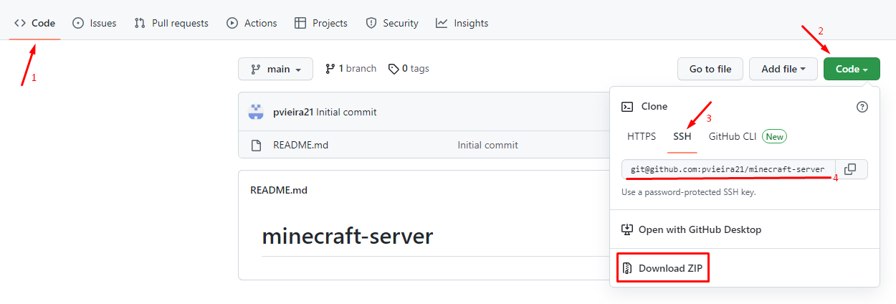
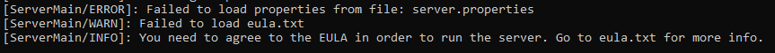
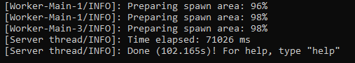
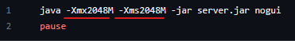
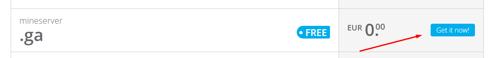
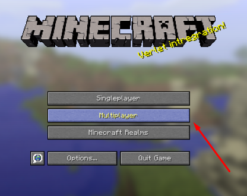
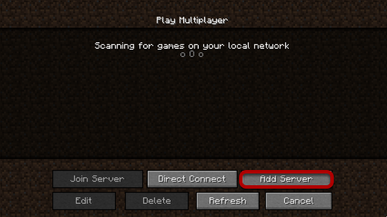
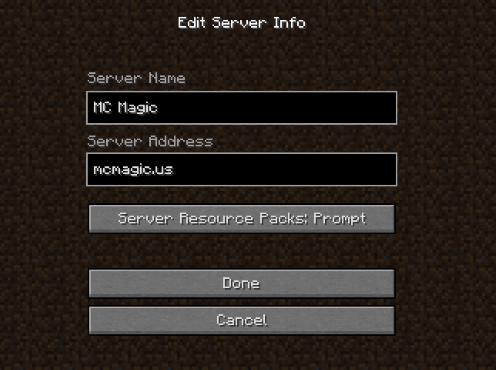

# Minecraft Server Setup

## Introduction

Hi! This repository is to help you out to easily setup (step by step) a **Minecraft Server** from starting the server locally to "publishing" it online for your friends to join and play. 

## [STEP 1] Clone or download the repository

To clone the project with **git** just follow the steps shown in the image below, or just download the **ZIP file** of the repository, and extract it.

## [STEP 2] Download Java

You'll need to download the version of Java **compatible** with the Minecraft version you want your server to run (you can easily find the right one on the Internet) - [Download here](https://www.oracle.com/java/technologies/downloads/)

**NOTE: Java 8 is the minimum required to run Minecraft versions 1.12 through 1.17, and Java 17 to run Minecraft version 1.18 and up [(for more information)](https://help.minecraft.net/hc/en-us/articles/4409225939853-Minecraft-Java-Edition-Installation-Issues-FAQ)**

## [STEP 3] Server setup (locally)

After you cloned/downloaded & extract the repository, you want to download [the latest version](https://www.minecraft.net/en-us/download/server) (or a specific version with or without mods) of the **JAR file** of the server and name it **"server.jar"** (the version from the one present in repository is 1.19.2).
After that, you'll run the file **start_server.bat** (by clicking it) and wait until you see the following error:

To solve this, you'll have to edit the generated file "**eula.txt**" and change the code ``eula=false`` to ``eula=true``, and then run it again.

Now your server is running locally in your machine. To stop the server just type the command ``stop`` in the command-line.

**Note: Please pay attention to the minimum (``-Xms``) amd maximum (``-Xmx``) amount of RAM you want to allow your server to use in the file *start_server.bat*. Right now, is 2GB (``-Xms2048 -Xmx2048``, repesented in Megabytes, use [this site](https://www.gigacalculator.com/converters/convert-gb-to-mb.php) for conversions). For more information, check [this article](https://aikar.co/2018/07/02/tuning-the-jvm-g1gc-garbage-collector-flags-for-minecraft/).**

**Now let's run the server online!**

## [STEP 4] Port forward your server

In order for your friends to be able to join your server, besides letting them know your **Public IP Address** [(check your Public IP Address here)](https://whatismyipaddress.com/), you'll need to [port forward](https://www.youtube.com/watch?v=2G1ueMDgwxw) your server (the default port that Minecraft Server uses is **25565**). You have this [tutotial](https://www.youtube.com/watch?v=X75GbRaGzu8) to help you with that! 

## [STEP 4.1] Pick a domain and add it to Cloudflare

**NOTE: This step is OPTIONAL!**

You can get a domain for your server, so it's easier for you to tell anyone the server's IP without memorizing a bunch of numbers (and letters, if you're working with IPv6) - You can pick one **FREE** at [Freenom](https://www.freenom.com/en/index.html).

**IMPORTANT NOTE: Due to some legal problems, Freenom is temporally not giving any more free domains, so unfortunately you'll have to find an alternative. For further information on the topic, [check here](https://circleid.com/posts/20230527-meta-lawsuit-leads-to-significant-decline-in-phishing-domains-tied-to-freenom).**

After setting your domain, you'll need to [create an account](https://dash.cloudflare.com/sign-up) at **Cloudflare** (or [login](https://dash.cloudflare.com/login) if you have already one), and follow the steps of this [tutorial](https://www.youtube.com/watch?v=1HMHTQhuV9w).

## [STEP 5] Play and have fun

For the final step, you'll just need to add your server in the Minecraft, by specifing the server's IP (or domain)

 

 

**NOTE: If you're using IP, don't forget to tell your the port! For example: 192.168.1.1:25565**

# Enjoy your server! Hope this helped you :)
